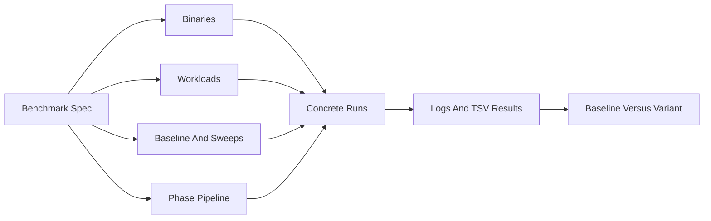

# Understanding Benchmark Runs

This guide explains what `rdbtools` runs, why it runs those steps, and how to read the output. It is written for someone who has not used Mark Callaghan's RocksDB scripts before.

`rdbtools` does not start from a shell command with many positional arguments. It starts from a JSON spec. The spec describes the binaries, machine profile, workload profile, baseline config, optional sweeps, and phase pipeline. The runner expands that into concrete `db_bench` runs.



## The Core Idea

A benchmark campaign answers one question:

> If I keep most things fixed, what changes when I use this RocksDB version, workload, machine profile, or config value?

Mark's scripts did this with shell wrappers like `x.sh`, `x3.sh`, and `benchmark_compare.sh`. `rdbtools` keeps the same experimental structure but makes each dimension explicit in JSON.

The first scenario is `scenarios/01-smoke.json`. It currently says:

- Use one binary label: `10.6.clang`.
- Use one workload: `iobuf`.
- Use one machine profile: `c8r16`.
- Use the `lsm-default` phase pipeline.
- Run one baseline and no sweeps.

That expands to:

```text
1 binary * 1 workload * 1 baseline
= 1 concrete run
```

Each concrete run then executes the phase list from `pipelines/lsm-default.json`. A full run has 11 phases. A smoke run skips phases marked `full_only`, leaving 5 phases.

## Run Dimensions

### Binary

The binary is the `db_bench` executable being tested. A label like `10.6.clang` resolves to:

```text
bin/db_bench.10.6.clang
```

Use this dimension to compare RocksDB versions, compilers, or build modes while keeping the same workload and config.

### Machine Profile

The machine profile is a bundle of settings that should move together for a hardware class. For example, `c8r16` represents an 8 CPU / 16 GiB class and sets values like:

- `WRITE_BUFFER_SIZE_MB`
- `TARGET_FILE_SIZE_BASE_MB`
- `MAX_BYTES_FOR_LEVEL_BASE_MB`
- `MAX_BACKGROUND_JOBS`
- `CACHE_SIZE_MB`
- `SUBCOMPACTIONS`

These are bundled because changing only one of them can create an unrealistic LSM shape for the machine. If you want to study one variable in isolation, use a sweep.

### Workload Profile

The workload profile defines what kind of data and IO behavior the run uses.

Common profiles:

- `byrx`: memory-sized, buffered IO, no compression.
- `byos`: OS-cache style, buffered IO, no compression.
- `iobuf`: larger buffered-IO workload, usually `lz4`.
- `iodir`: larger direct-IO workload, usually `lz4`.
- `blob-iobuf`: buffered BlobDB workload with larger values.
- `blob-iodir`: direct-IO BlobDB workload with larger values.

Profiles can declare `key_count_source` as `nk_mem` or `nk_io`. Specs can then provide top-level `nk_mem` and `nk_io` values to size cached and IO-bound workloads differently. A baseline `NUM_KEYS` still overrides that behavior when you want a quick ad-hoc test.

For example, `blob-iobuf` sets `VALUE_SIZE=3200`, enables `COMPACTION_STYLE=blob`, includes BlobDB GC defaults, and normally reads its key count from `nk_io`. That makes it meaningful for testing options like `BLOB_FILE_SIZE`.

### Baseline

The baseline is the fixed config all variants are compared against. In the smoke scenario it includes:

- `NUM_THREADS=1`
- `NUM_KEYS=1000000`
- `VALUE_SIZE=400`
- `DURATION_RW=30`
- `DURATION_RO=30`
- `COMPACTION_STYLE=leveled`

The baseline should represent the current default or the control case. Most sweeps should change only one thing at a time from this baseline.

### One-At-A-Time Sweep

A one-at-a-time sweep changes one variable while holding the rest fixed.

Example:

```json
{
  "name": "blob_file_size",
  "mode": "one_at_a_time",
  "params": {
    "BLOB_FILE_SIZE": [8388608, 16777216, 67108864, 268435456]
  }
}
```

This creates four variants:

- `blob_file_size__BLOB_FILE_SIZE_8388608`
- `blob_file_size__BLOB_FILE_SIZE_16777216`
- `blob_file_size__BLOB_FILE_SIZE_67108864`
- `blob_file_size__BLOB_FILE_SIZE_268435456`

Use this when you want to explain the individual effect of a setting.

### Matrix Sweep

A matrix sweep tests every combination of several variables.

Example:

```json
{
  "name": "readahead_io_matrix",
  "mode": "matrix",
  "params": {
    "COMPACTION_READAHEAD_SIZE": [122880, 262144, 491520, 2097152],
    "USE_O_DIRECT": [0, 1],
    "COMPRESSION_TYPE": ["none", "lz4"]
  }
}
```

This creates:

```text
4 readahead values * 2 IO modes * 2 compression modes = 16 variants
```

Use matrix mode only when settings interact. It grows quickly.

## Why The Mark Phase Order Exists

The `lsm-default` pipeline is not a random list of `db_bench` jobs. It builds an LSM, lets compaction catch up, measures reads, perturbs the tree with writes, stabilizes it, and then measures mixed and write-heavy behavior.

### 1. `load`: `fillseq_disable_wal`

This creates the initial database using sequential inserts and disables WAL for load speed.

Purpose:

- Build a known starting dataset.
- Populate the LSM before read and overwrite tests.
- Avoid measuring WAL overhead during bulk load.

Important env:

- `DB_BENCH_NO_SYNC=1`
- `DURATION=0`
- `WRITES=0`

### 2. `drain_revrange`: `revrange`

This is a short reverse range-read phase with only `NUM_KEYS=100` and `NUM_THREADS=1`.

Purpose:

- Give background compaction time to bleed off after the load.
- Avoid starting the main read/write phases while load compaction is still dominating the system.

Important env:

- `DURATION=300`
- `NUM_KEYS=100`
- `NUM_THREADS=1`

### 3. Read-Only Checks: `readrandom`, `fwdrange`, `multireadrandom`

These phases are marked `full_only`, so `--smoke` skips them.

Purpose:

- `readrandom`: point lookup behavior.
- `fwdrange`: forward range scan behavior.
- `multireadrandom`: batched point lookup behavior with `MULTIREAD_BATCHED=1`.

These phases use `DURATION_RO` from the baseline when the phase does not provide its own `DURATION`.

### 4. `overwritesome`: Partial Overwrite

This phase updates part of the keyspace.

Purpose:

- Introduce stale data.
- Create compaction pressure.
- Make BlobDB garbage collection and LSM write amplification visible.

Important env:

```text
WRITES = NUM_KEYS / NUM_THREADS / 10
DURATION = 0
```

This is why the pipeline uses `WRITES_EXPR` instead of a fixed number.

### 5. `flush_mt_l0`: Stabilize The LSM

This phase flushes memtables and helps shape the LSM before mixed read/write tests.

Purpose:

- Reduce noise from pending memtables.
- Make later phases more comparable between variants.

### 6. Mixed Read/Write Phases

These phases are also `full_only`:

- `revrangewhilewriting`
- `fwdrangewhilewriting`
- `readwhilewriting`

Purpose:

- Measure read behavior while writes and compactions are active.
- Expose stalls, write amplification, compaction bandwidth, and BlobDB GC behavior under pressure.

These phases are rate-limited. If `MB_WRITE_PER_SEC` is set, it should apply here, not to load. They use `DURATION_RW` from the baseline when the phase does not provide its own `DURATION`.

### 7. `overwriteandwait`: Terminal Write-Heavy Phase

This is the final write-heavy phase. It waits for background work where supported. If a binary does not support it, the pipeline records `FALLBACK_JOB=overwrite`.

Purpose:

- Measure sustained overwrite throughput.
- Make write stalls and compaction debt visible.
- Provide a strong signal for write-heavy tuning.

For many config options, this is one of the most important phases.

## Rate-Limited Vs Non-Rate-Limited

Mark separates phases into load, no-limit, and rate-limited groups.

Non-rate-limited phases answer:

> How fast can this operation run if we let it go as fast as possible?

Rate-limited mixed phases answer:

> What happens to reads, stalls, and compaction when writes arrive at a controlled rate?

This matters because applying `MB_WRITE_PER_SEC` to load would hide load capacity, while not applying it to mixed phases can make variants incomparable.

## Output Artifacts

Each concrete run writes to:

```text
runs/<campaign>/<run_id>/<binary>/<workload>/
```

Important files:

- `resolved-env.json`: the final environment bundle after machine, workload, baseline, and sweep values are merged.
- `variant.json`: the sweep metadata for this run.
- `benchmark_<phase>.log`: raw `db_bench` output for each phase.
- `iostat.log`, `vmstat.log`: optional per-phase Linux observability captures when `execution.capture_io_stats` is true.
- `report.tsv`: one row per phase for that concrete run.
- `aggregate.tsv`: created by `scripts/rdb-collect.sh`; combines many `report.tsv` files into one long-form result.
- `compare_*.tsv`: created by `scripts/rdb-compare.sh`; compares baseline and variant metrics.
- `summary_*.tsv`: created by `scripts/rdb-summarize.sh`; pivots `aggregate.tsv` into a per-binary relative-metric matrix.

When something looks surprising, start with `variant.json` and `resolved-env.json`. They answer, "What did this run actually use?"

## Metrics To Watch

### `ops_sec`

Operations per second. Higher is usually better.

Use it for:

- Load throughput.
- Point lookup throughput.
- Range-scan throughput.
- Overwrite throughput.

### `mb_sec`

Throughput in MB/s when `db_bench` reports it.

Use it to understand scan or compaction bandwidth when available.

### `w_amp`

Write amplification. Lower is better.

This is often more important than raw `ops_sec` for compaction-sensitive settings. A variant can look fast briefly while creating too much compaction debt.

### `stall%`

Percent of time writes are stalled. Lower is better.

Use it to identify settings that make RocksDB unable to keep up with write pressure.

### Compaction MB/s And Blob GB Metrics

Compaction throughput and BlobDB read/write GB help explain why a run changed.

For BlobDB, watch for:

- Too-small blob files: many files, metadata overhead, more file descriptors.
- Too-large blob files: GC rewrites too much mostly-live data.

This is why `blob_file_size` can have a U-curve rather than "smaller is always better."

### RSS

RSS can be noisy for short phases. If `report.tsv` says RSS is unavailable, check the raw timing logs if the run captured them. Short 30s phases can be missed by coarse polling.

## What Specific Tests Are Asking

### `blob_file_size`

Question:

> What blob file size balances per-file overhead against BlobDB GC rewrite waste?

Small blob files create more files and can require a high `ulimit -n`. Large blob files can force GC to rewrite more live data than necessary. The useful signal often appears in write-heavy and mixed read/write phases, especially `overwriteandwait` and `fwdrangewhilewriting`.

### `compaction_readahead`

Question:

> Does compaction read ahead in chunks that match the storage device and IO mode?

Large readahead can help sequential compaction IO, but if it exceeds device or kernel request sizing, it can create CPU overhead or split IO inefficiently. This is why the example matrix pairs `COMPACTION_READAHEAD_SIZE` with `USE_O_DIRECT` and `COMPRESSION_TYPE`.

### `write_buffer`

Question:

> Does changing memtable size or background jobs reduce stalls without increasing compaction debt?

Bigger write buffers can reduce flush frequency, but they also change memory use and the size of work arriving at compaction. Background jobs should be interpreted with the machine profile.

### `lsm_shape`

Question:

> Is the LSM pyramid sized appropriately for this workload and hardware?

This is a matrix because `WRITE_BUFFER_SIZE_MB`, `TARGET_FILE_SIZE_BASE_MB`, and `MAX_BYTES_FOR_LEVEL_BASE_MB` interact.

## How To Read A Dry Run

Before running benchmarks:

```bash
scripts/rdb-run.sh --spec scenarios/01-smoke.json --dry-run
```

Check:

- Total concrete runs.
- Total phase count.
- Binary paths.
- Output directories.
- Run IDs.

For a quick structural check:

```bash
scripts/rdb-run.sh --spec scenarios/02-surrealdb-defaults-c64r120.json --dry-run --smoke
```

Smoke mode is useful for validating expansion and command shape. It is not a replacement for the full benchmark.

## Reading Results Without Fooling Yourself

- Compare variants against the same binary, workload, and phase.
- Do not compare `iobuf` directly to `blob-iobuf`; they test different value sizes and BlobDB behavior.
- Treat load results separately from mixed read/write results.
- For write tuning, look at `ops_sec`, `w_amp`, and `stall%` together.
- For BlobDB, include file count and `ulimit -n` in your notes.
- For matrix sweeps, identify interaction effects rather than picking a global winner from one metric.

The goal is not just to find the fastest number. The goal is to understand why the number moved and whether that behavior is stable enough to recommend as a default.
